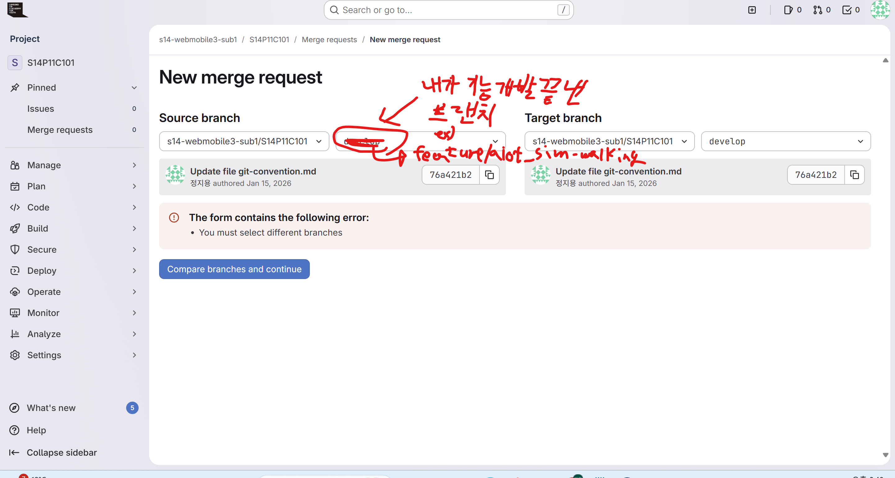

- 평상시 개발할 때
    - 2번 ~ 6-2번까지 순서대로 진행
- 하나의 기능 개발이 다 끝났을 때
    - 2번 ~ 8번까지 순서대로 진행

# 1. 처음 레포 받을 때 (처음 한 번만)

```bash
git clone <원격주소>

#이건 항상 체크하기 #작업할 폴더 내에서 작업하는 것을 습관화하자!
cd <내가 작업할 프로젝트 폴더> 
```

# 2. 매번 작업할 때 develop 브랜치 이동

```bash
git switch develop

#이건 항상 체크하기 #작업할 폴더 내에서 작업하는 것을 습관화하자!
cd <내가 작업할 프로젝트 폴더> 
```

(만약 에러 나면 → develop이 아직 로컬에 없을 수 있음)

그럴 땐:

```bash
git fetch origin
git switch develop
```

# 3. 작업 시작 시 / 작업 중 develop 최신화 권장

- **“지금 기준 최신 develop을 내 브랜치에 반영”하는 기본 도구**

```bash
git pull origin develop
```

# 4. 브랜치 전략 (실무에서 많이 쓰는 구조)

→ example)

- GAE의 보행 기능(sim 사용) 브랜치: feature/aiot_sim-walking
- GAE의 simtoreal 기능(ROS 사용) 브랜치: feature/aiot_ros-simtoreal

```
main        : 배포용 (직접 작업 ❌)
develop     : 통합 개발 브랜치
feature/*   : 기능 단위 작업 브랜치
```

### 브랜치 생성 & 이동

```
# git switch develop (앞에서 한 develop 브랜치로 이동하는 명령어)
# git pull origin develop (develop 브랜치 최신화)
# git branch (어떤 브랜치가 현재 존재하는지 확인)

# 작업할 브랜치가 없거나 새로 만들거라면?
-> switch : 이동 명령어 | -c : create 명령어
--> 만들기와 이동을 동시에 하는 명령어
git switch -c feature/(기능 이름)

# 작업할 브랜치가 있으면?
git switch (git branch로 확인한 브랜치의 이름)
```

### 작업 중간에 누군가 merge를 했을 시, 최신화 실시

```bash
git pull origin develop
```

# 5. 코딩하세요

# 6-1. 코딩 중간 or 코딩 끝나고 작업 흐름 남기기 (⭐)

```bash
# git status # 내가 어떤 파일을 수정했는지 알려줌

git add . # 전체 변경 파일 스테이징
# git add (디렉토리명 or 파일명) # 해당 변경 디렉토리 or 파일만 스테이징

git commit -m "메시지" # 커밋은 6-2번 커밋 메시지 컨벤션에 맞춰서 적기

# git graph 깔고 거기서 커밋메시지 남기고 푸쉬해도 됨.
# 그리고 git graph 자주 확인하고 브랜치 최신화 맞추기!
git push origin 브랜치명
```

# 6-2. 커밋 메시지 컨벤션

```
1. chore: 프로젝트가 돌아가게 하기 위한 준비 작업
2. feat: 새로운 기능 추가
3. fix: 버그 수정
4. docs: .md 파일 수정
```

→ example)

- GAE의 보행 기능(sim 사용) 일부 완성(비틀비틀 걷기 시작)
    - **git commit -m “feat:GAE 보행 기능 개발 - 비틀비틀 걷기 시작”**

## 참조) 자주 쓰는 명령어 모음

```bash
git log --oneline        # 커밋 로그 요약
git branch               # 브랜치 목록 확인
git switch 브랜치명       # 브랜치 이동

# 고수들은 잘 씀(우리 level에선 잘..)
git stash                # 임시 저장
git stash pop            # 다시 적용
```

# 7. 내가 맡은 하나의 기능 구현이 다 되면 MR(=PR) 올리고 Merge 하기



- **GitLab은 Merge Request**, GitHub은 Pull Request
- **맡은 기능이 완전히 다 구현이 되었을 때 MR을 올립니다!** **오늘 하루 일 다 끝났다거나 잠깐 쉬기 전**에 코드 반영하는 건 **6-1번으로 가세요!**
- 기능 개발이 완료되어 **Merge Request(MR)**가 통과되면, 원격(GitLab/GitHub) 브랜치는 자동으로 삭제되도록 설정할 수 있습니다. 하지만 **여러분의 로컬(내 컴퓨터) 브랜치는 수동으로 정리**해 주어야 합니다.
- 설명 읽기 귀찮으시면 그냥 **아래 두 명령어를 전부 터미널에 치세요!**

### 로컬

```bash
git branch -d (기능 구현이 다 된 브랜치명)

# 예시
# git branch -d feature/aiot_sim-working
```

그게 아니면 아래 명령어로 원격도 삭제 해주세요

### 원격

```bash
git push origin --delete (기능 구현이 다 된 브랜치명)

# 예시
# git push origin --delete feature/aiot_sim-working
```

# 8. MR(=PR) 양식

- **GitLab은 Merge Request**, GitHub은 Pull Request
- 팀원들은 올라온 MR(PR)을 확인한 후 작업 사항을 반영할지 말지 approve 여부 남기기
    - 모든 팀원들이 승인한 후 merge 버튼을 누를 수 있음
        - **!주의!** PR 올릴 때 **무조건 develop 브랜치로** 바꿔 올리기
            - **master/main 에 올리면 절대 안돼!!!!!!**
    - merge 후, 꼭 팀 전원에게 연락(MM, 카톡방 등)을 남기기
- 아래 양식에 맞춰 MR(PR) 작성

# 🤖 [Isaac Lab] Merge Request Template

```bash
## 📌 작업 개요 (Summary)
* **기능 이름:** (예: Spot Micro 보행 학습 환경 구축)
* **목적:** (예: RL 기반의 안정적인 평지 보행 제어기 학습)
* **핵심 변경 사항:** (예: 가상 환경 내 지형 생성 로직 및 보상 함수 추가)

## 🛠 세부 작업 내용 (Detailed Changes)
### 1. 시뮬레이션 환경 및 에셋 (Environment & Assets)
* **Scene 구성:** (예: `GroundPlane` 설정 변경, 장애물 `USD` 에셋 추가)
* **로봇 모델:** (예: Spot Micro의 URDF 수정, 관성(Inertia) 파라미터 튜닝)
* **센서 설정:** (예: LiDAR 가시거리 조정, 스테레오 카메라 해상도 설정)

### 2. 로직 및 알고리즘 (Logic & Script)
* **Task/Task Config:** (예: Observation space에 발바닥 접촉 센서 추가)
* **Reward Design:** (예: 직진 속도 보상 가중치 상향, 에너지 소비 페널티 추가)
* **Controller:** (예: 기본 PD 제어기 Kp/Kd 게인값 수정)

### 3. 종속성 및 환경 설정 (Dependencies)
* **Extensions:** (예: `omni.isaac.ros2_bridge` 활성화 필요)
* **Library:** (예: `pip install torch-geometric` (GNN 활용 시))

## ✅ 테스트 결과 (Test Results)
* **[ ] 시각적 확인:** Isaac Sim 실행 화면 (로봇의 움직임, 센서 데이터 시각화 스크린샷/GIF)
* **[ ] 학습 지표:** Tensorboard 또는 WandB 리워드 그래프 (학습이 잘 진행되는지 확인)
* **[ ] 성능 로그:** 시뮬레이션 FPS(성능 저하 여부), 터미널 내 물리 엔진 경고 메시지 유무
* **[ ] 체크리스트:**
	* [x] 가상 환경에서 로봇이 충돌 없이 초기화되는가?
	* [x] 센서 데이터가 의도한 주파수(Hz)로 들어오는가?

## 📢 참고 사항 (Notes)
* **실행 전 필수 작업:** "Isaac Lab 실행 시 `--task SpotMicroWalk` 인자를 꼭 붙여주세요."
* **에셋 경로:** "로컬에 저장된 `spot_micro.usd` 파일 경로가 `Documents/Assets`로 설정되어 있어야 합니다."
* **한계점:** "현재는 평지 보행만 가능하며, 계단 등 복잡한 지형은 다음 작업에서 구현할 예정입니다."
```